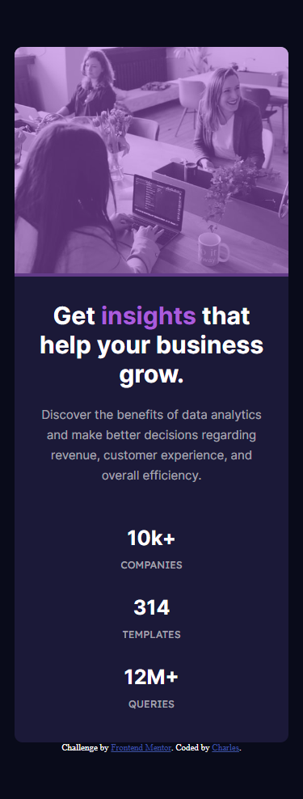

# Frontend Mentor - Stats preview card component solution

This is a solution to the [Stats preview card component challenge on Frontend Mentor](https://www.frontendmentor.io/challenges/stats-preview-card-component-8JqbgoU62). Frontend Mentor challenges help you improve your coding skills by building realistic projects.

## Table of contents

- [Overview](#overview)
  - [Screenshot](#screenshot)
  - [Links](#links)
- [My process](#my-process)
  - [Built with](#built-with)
- [Author](#author)

## Overview

### Screenshot

### Links

- Solution URL: [Add solution URL here](https://www.frontendmentor.io/solutions/nft-preview-card-component-JlXCX_JaXy)
- Live Site URL: [Add live site URL here](https://nft-preview-card-component-charles.netlify.app/)

## My process

### Built with

- Semantic HTML5 markup
- CSS

## Author

-Front End Mentor: [Cha-er-si](https://www.frontendmentor.io/profile/Cha-er-si)
